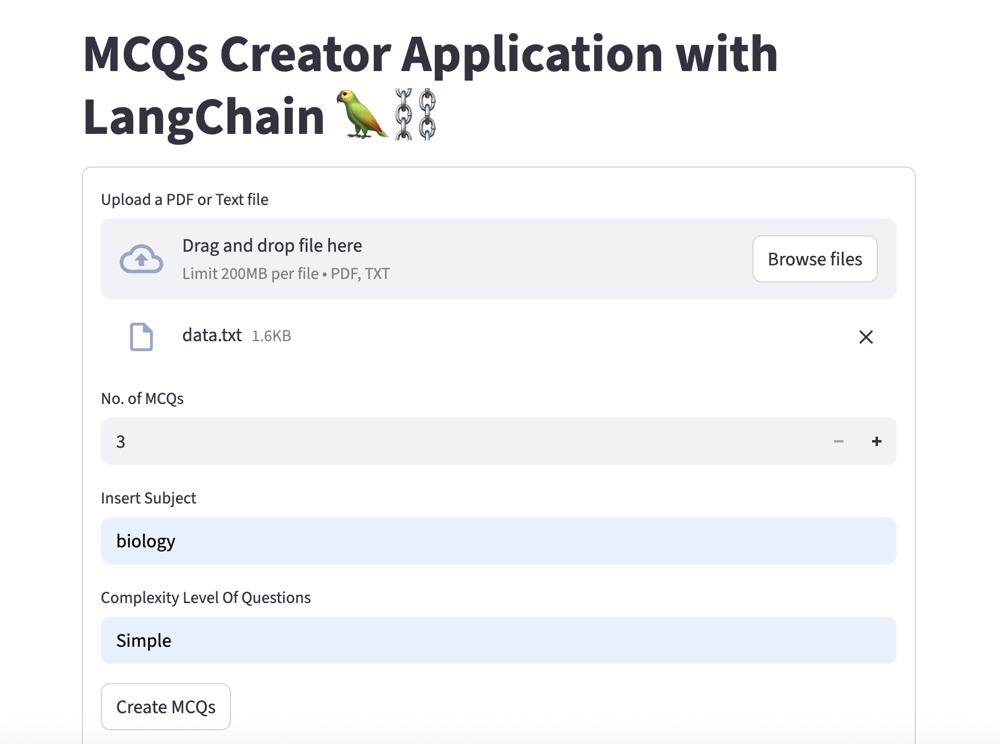
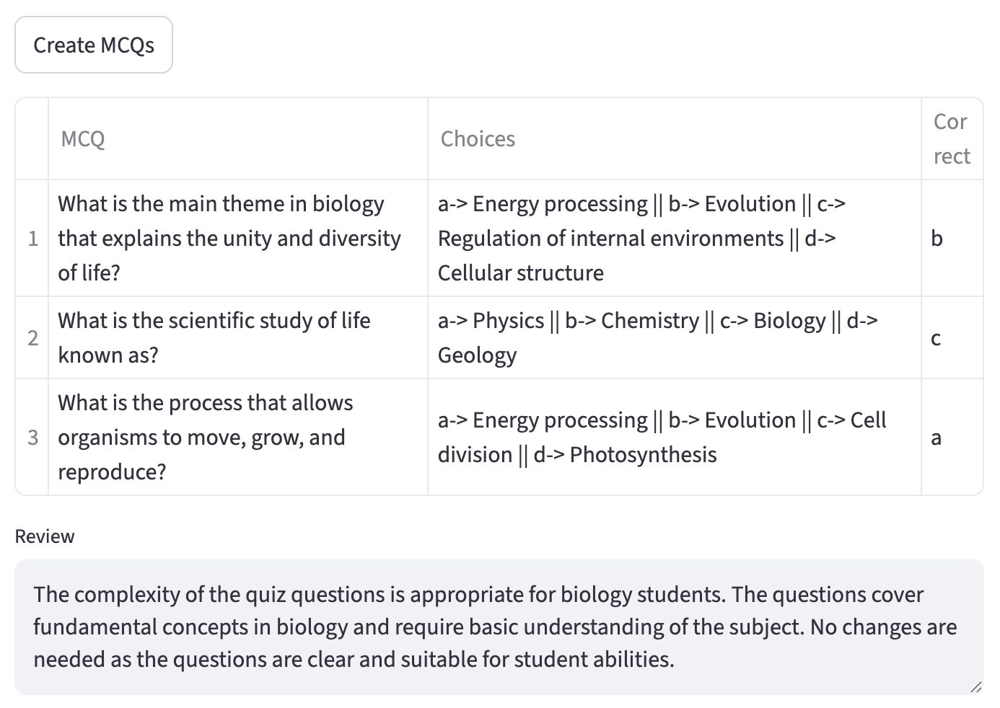

MCQ Generator

MCQ Generator is an AI-powered tool that automatically creates multiple-choice questions (MCQs) from any given text. It uses the OpenAI API for natural language understanding and a Streamlit-based web app for an interactive user interface.

This project is useful for:
	•	Teachers creating quiz questions.
	•	Students generating practice questions.
	•	E-learning platforms automating assessments.
	•	Interview and exam preparation.

⸻

🚀 Features
	•	Automatic MCQ Generation – Generate questions and options from any input text.
	•	OpenAI Integration – Uses GPT-based models for high-quality, context-aware questions.
	•	Interactive UI – Streamlit app with radio button selection for answers.
	•	JSON Output – Returns structured data with questions, options, and correct answers.
	•	Deployable – Ready for deployment on AWS EC2 (Ubuntu) or local machine.

⸻

⚙️ How It Works
	1.	User inputs a text passage through the Streamlit app.
	2.	The text is passed to the MCQ Generator module.
	3.	The module prepares a prompt and calls the OpenAI API.
	4.	The API returns structured MCQs in JSON format (Response.json as example).
	5.	Streamlit displays questions and options in an interactive format.

Workflow:

Input Text → Process & Prompt → OpenAI Model → JSON MCQs → Streamlit UI

⸻

🛠️ Tech Stack
	•	Python
	•	Streamlit (Web UI)
	•	OpenAI API (MCQ Generation)
	•	dotenv (API key management)

⸻

📂 Project Structure

MCQGenerator/
│── mcqgenerator/       # Core logic for generating MCQs
│── StreamlitApp.py     # Streamlit-based frontend
│── requirements.txt    # Dependencies
│── setup.py            # Package setup file
│── Response.json       # Sample MCQ output
│── README.md           # Project documentation

⸻

⚡ Setup & Usage

1. Clone the Repository

git clone https://github.com/sunnysavita10/MCQGenerator.git
cd MCQGenerator

2. Install Dependencies

pip install -r requirements.txt

3. Add OpenAI API Key

Create a .env file in the project root and add:

OPENAI_API_KEY=your_api_key_here

4. Run the Streamlit App

python3 -m streamlit run StreamlitAPP.py

5. Screenshots

